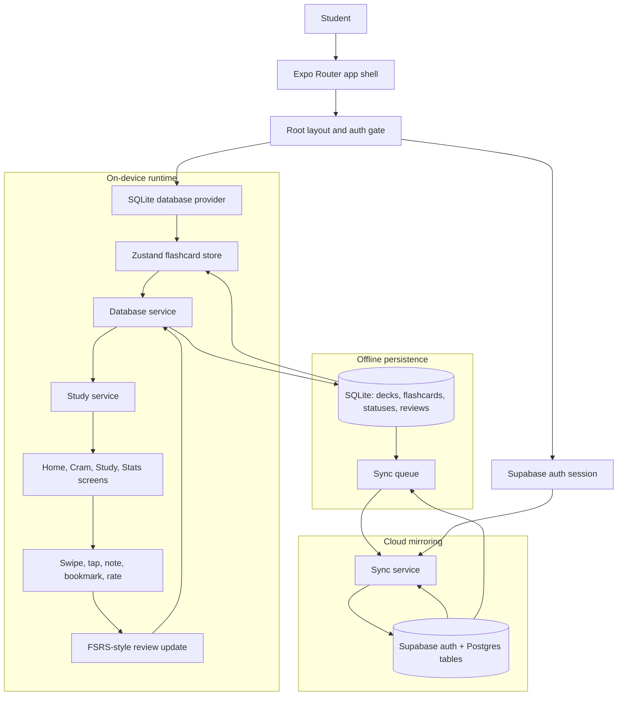
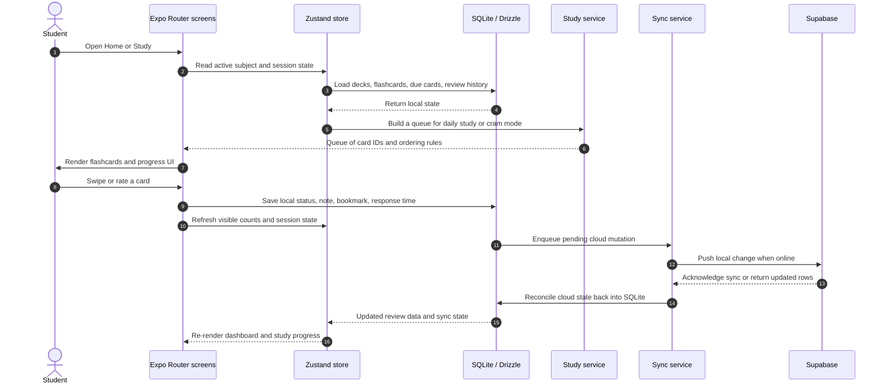

# Cramit

Cramit is an offline-first flashcard app for serious exam preparation. It is designed around a simple idea: students should be able to study anywhere, even without a connection, while the app quietly keeps their progress, notes, and review history in sync when they come back online.

From a recruiter perspective, this repository shows a product-focused mobile app that combines local database engineering, sync logic, spaced repetition, and a polished React Native UI in one system.

## Recruiter snapshot

If you only scan a few things, this is the short version:

- a real mobile product, not a demo shell
- offline-first architecture with SQLite as the main runtime data layer
- cloud sync through Supabase without making the app depend on the network for daily use
- a study engine that schedules cards based on review state and learning mode
- a codebase that separates UI, state, services, and persistence cleanly

## What the project does

Cramit helps students:

- sign in and keep their study data tied to an account
- choose subjects and chapters to work on
- review flashcards in a guided daily study flow
- use a separate cram mode to focus on weak areas, concepts, formulas, or mistakes
- track progress through stats, streaks, and review history
- store notes, bookmarks, and response-time data per card
- continue studying offline and sync changes later

The app is built for exam-style revision rather than general note taking. The core experience is optimized for repeated recall, not passive browsing.

## What to notice in the code

- `app/` contains the actual product screens and navigation flow
- `db/` sets up the local SQLite database and migrations
- `services/` contains the business logic for study queues, sync, and persistence
- `store/` keeps UI state lightweight while the database holds the real learning data
- `utils/spaced-repetition.ts` contains the scheduling logic that powers review timing

This structure is useful for recruiters because it shows an app that is deliberately layered instead of all logic living inside screen components.

## How it works

The important technical choice in this codebase is that the phone is the primary source of truth for day-to-day study. SQLite stores the live learning state locally, and Supabase is used for authentication and cloud mirroring.



### Local-first data model

The app initializes a local SQLite database on startup and uses it for decks, flashcards, review state, active chapters, and sync queue entries. That means the main screens can render from fast local reads instead of waiting on a remote API.

### Study engine

The study flow is driven by a service layer that assembles the next queue of cards based on the current subject, the selected chapters, and the card state. New and due cards are mixed carefully so students keep moving forward even if they have a backlog.

The app also supports cram sessions that bypass normal spaced-repetition updates. That lets a student drill formulas, concepts, or mistake-heavy cards without corrupting the long-term learning schedule.

### Sync strategy

When the device is online, a background sync service pushes local changes to Supabase and pulls cloud state back down. The code is built to tolerate offline usage first, then reconcile later.

That sync layer covers:

- card status updates
- due dates and FSRS fields
- bookmarks and notes
- active chapter selection
- review history and response times

## Main user flows

### 1. Authentication

Users sign up and log in through Supabase-backed auth. The app stores session state locally and restores it on launch, so users do not have to re-authenticate every time they open the app.

### 2. Home

The Home tab is the main learning dashboard. It shows the user what to study next, how many cards are due, and which subjects are active. The interface is designed to feel compact and high-signal rather than cluttered.

### 3. Cram mode

The Cram tab lets a student focus on a subject and filter by learning intent, such as formulas, concepts, or mistakes. This is useful for short revision sessions and last-minute prep.

### 4. Study session

The study screen is swipe-driven and supports LaTeX/math rendering, notes, bookmarking, and response timing. After each answer, the app updates local progress and queues the change for sync.

### 5. Stats

The Stats tab shows review activity, streaks, and progress signals that make the app more than a card swiper. It turns the learning history into visible feedback.

## Architecture highlights

The repository is useful as an engineering sample because it shows a clean separation between UI, state, and data access:

- Expo Router handles navigation and screen structure
- React Native provides the mobile UI layer
- Zustand manages lightweight app state
- Drizzle ORM talks to SQLite locally
- Supabase handles auth and remote persistence
- a service layer owns business rules such as review scheduling, deck loading, and sync



## Tech stack

- Expo + React Native
- Expo Router
- TypeScript
- SQLite
- Drizzle ORM
- Supabase
- Zustand
- Vitest
- NativeWind and custom RN styling
- KaTeX and math rendering support

## Local development

### Requirements

- Node.js 18+ recommended
- npm
- Expo Go, Android emulator, iOS simulator, or a web browser depending on your target platform

### Environment variables

The app expects Supabase credentials in `.env`:

- `EXPO_PUBLIC_SUPABASE_URL`
- `EXPO_PUBLIC_SUPABASE_ANON_KEY`
- `DATABASE_URL`
- `TEST_DATABASE_URL`

### Install and run

```bash
npm install
npm start
```

Run a specific target if needed:

```bash
npm run android
npm run ios
npm run web
```

## Available scripts

| Script | Purpose |
| --- | --- |
| `npm run start` | Start the Expo app |
| `npm run android` | Launch Android |
| `npm run ios` | Launch iOS |
| `npm run web` | Launch web |
| `npm run lint` | Run ESLint |
| `npm run lint:fix` | Auto-fix lint issues |
| `npm run format` | Format code with Prettier |
| `npm run ts:check` | Type-check the codebase |
| `npm run test` | Run Vitest once |
| `npm run test:watch` | Run Vitest in watch mode |
| `npm run coverage` | Generate test coverage |

## Repository layout

- `app/` Expo Router screens and navigation groups
- `components/` reusable UI pieces
- `db/` local SQLite provider, schema, and migrations
- `services/` app business logic and sync/data orchestration
- `store/` lightweight app state
- `utils/` shared algorithms such as spaced repetition
- `lib/` backend client setup
- `assets/` images, starter data, and rendering assets

## Why this project is interesting

This repository demonstrates more than a UI build. It shows how to design a product where the app still works when the network does not, how to keep learning data consistent across devices, and how to turn a complex educational workflow into a mobile experience that feels fast and deliberate.

For recruiters, the strongest signal here is the architecture: the app is not just rendering cards. It is managing persistence, sync, session scheduling, and an opinionated learning loop on-device.

## Notes

Some screens and debug tools in the repository are meant for development and inspection rather than production use. The core student experience lives in the Home, Cram, Study, and Stats flows.
